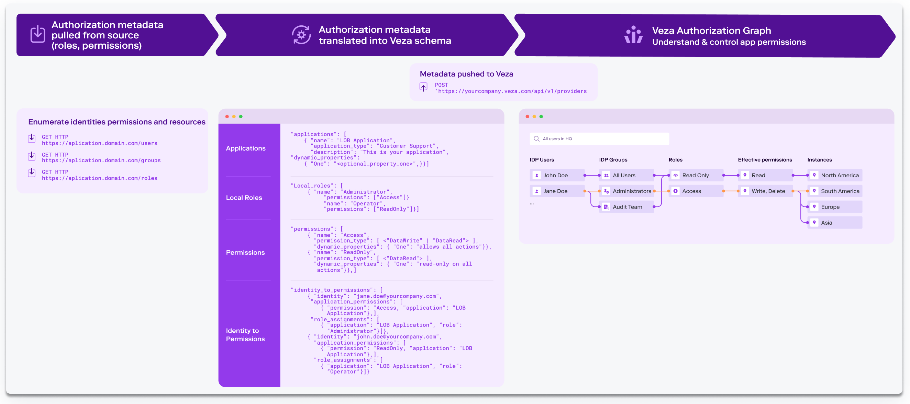

# Veza Open Authorization API (OAA) Community

To help customers get up and running quickly using Open Authorization API (OAA) we created the Veza OAA Community. This
repository includes libraries for developing new connectors, several pre-built connectors, examples and documentation.
The connectors in the repository (for JIRA, for Zendesk, etc.) are ready for immediate use by following the
instruction in each connectors README.

Veza customers and partners can use the community as a resource for developing their own connectors and tooling, and are
encouraged to contribute to add support for new sources (apps, databases, etc.) or improve existing ones.

## Veza Overview
Veza is the authorization platform for data. Our platform is purpose-built for multi-cloud
environments to help you use and share your data more safely. Veza makes it easy to dynamically visualize, understand
and control who can and should take what action on what data. We organize authorization metadata across identity
providers, data systems, cloud service providers, and SaaS applications — all to help organizations with critical
use cases of access governance, privilege access, cloud entitlements, data lake security, etc.
To learn more, please visit us at veza.com.

## Open Authorization API (OAA)

Veza natively supports 40+ integrations natively for systems such as Azure SharePoint, Snowflake, AWS services,
GCP services, SQL Server, etc. That said, there are often scenarios where organizations want to integrate Veza
to an in-house system, or a custom SaaS application, or any system (databases, etc.) that we don’t yet support
natively. You might have a custom or homegrown SaaS or on-prem app - for example, a customer service or support
app that holds or accesses sensitive data - for which you want to visualize and manage access to these critical
systems. Our Open Authorization API (OAA) enables Veza customers and partners to integrate custom and other
3rd party SaaS applications and data systems using a standard interface.

OAA connector has 3 jobs: it needs to pull authorization data from the target system (i.e., SaaS app, data
storage system, or custom software, etc.), transform that data into a format Veza understands, and call the
Veza API to import the data into Veza. Using OAA and connectors, organizations can parse and upload authorization
metadata for custom SaaS apps and create a more complete view of permissions across cloud/data/identity systems to
answer the question: “who can and should take what action on what data?”

Open Authorization API is not currently associated with any open source bodies (IETF, etc.). We will be working with 
various teams to pursue open standards over course of time. All OAA resources in this repository are licensed under
the MIT license.

For any feedback on Open Authorization API - for example, API enrichments, etc. - please open an issue. We encourage you 
to please join our [Slack community](https://join.slack.com/t/veza-world/shared_invite/zt-17d9quyiq-20JMp0ikZ0pVNz_e5W5j7Q) to share the feedback.

## How OAA Works
OAA works by providing a mechanism to upload authorization information from a target system (e.g. SaaS app,
custom application, data system, etc.) to Veza in a standardized format. To integrate a new system, you utilize
that system's API (or other interfaces) to enumerate authorization data - the identities, permissions and
resources - that you want available via Veza. This information must then be formatted according to the OAA JSON
schema and uploaded to Veza using the OAA REST API.

Veza processes this schema mapping to integrate metadata from the new target system (e.g. SaaS app,
custom application, data system, etc.) into its Authorization Metadata Graph, which maps which identities
have what entitlements / permissions to what resources. Veza combines this information with discovered data from
Identity providers to expand group memberships and correlate identities. Identities can be local to
that application or linked to external Identity Providers (IdP) like Okta or AzureAD. The Veza schema can capture and
represent both standard Effective Permissions (Create, Read, Update, and Delete) as well as system-specific permissions
(like “Admin” or “Operator”).

Once a target application or system is integrated via OAA into Veza, it acts like any other system configured to Veza.
OAA-integrated systems are fully available for the purpose of Veza search, governance workflows, reports, alerts, and more.

## Getting Started

To use an existing connector see the README file in the connector directory. Each README will contain an
overview and instructions for how to use the connector. Download the code and follow the setup instructions to use the
connector in your application.

To get started developing your own connectors:
* Consult the Open Authorization API section of the Veza User Guide
* See the samples directory:
  * `sample-app.py` - sample generic application, suitable for most SaaS apps.
  * `sample-idp.py` - sample custom identity provider, for IdPs and other identity related services
* Use the `oaaclient` SDK for developing your own connectors in Python

## Connectors

The Community repository includes the following existing connectors, each connector is in its own directory with
instructions.

Connector       | Support Level  | Language | Notes
----------------|----------------|----------|-----------------------------------------------------------------------------
BitBucket Cloud | Veza Supported | Python   | Bitbucket Cloud connector repository permissions
GitHub          | Veza Supported | Python   | Support for GitHub Cloud for discovery organization's repository permissions
GitLab          | Veza Supported | Python   | Discovery for GitLab project permissions
Jira            | Veza Supported | Python   | Jira Cloud support for projects
Looker          | Veza Supported | Python   | Looker User authorization for models and connections
PagerDuty       | Veza Supported | Python   | PagerDuty user roles and teams
Slack           | Veza Supported | Python   | Slack workspace members and roles
Zendesk         | Veza Supported | Python   | Zendesk user to role assignments

### Support Levels
#### Veza Supported
A connector that is fully supported by Veza. Veza is committed to the functionality of the connector and will fix
issues based on severity and demand. Veza tests the connector prior to any updates posted to the community.

#### Community Supported
A connector that has been contributed to the community and reviewed by Veza. Veza may not be able to provide full
support for the connector and may not have the ability to test the connector. Any improvements or fixes to the
connector will come through the community.

## Contributing
If you are interested in contributing improvements or new connectors see our [guide](docs/CONTRIBUTING.md)

## Join Us on Slack
Join us on Slack at [veza-oaa-community](https://join.slack.com/t/veza-world/shared_invite/zt-17d9quyiq-20JMp0ikZ0pVNz_e5W5j7Q)
