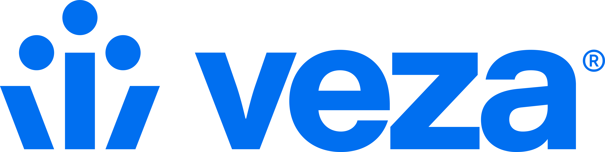
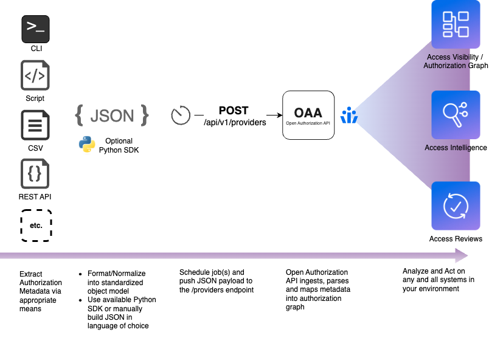

# Open Authorization API (OAA) Community

OAA Community is a repository of production quality [example connectors](/connectors/) and [quickstart samples](/quickstarts/)
that can be consumed under open source [license](./LICENSE). 
We provide these connectors to help customers get up and running quickly developing their own connectors,
whether they are for in-house, custom applications or systems that aren't yet part of Veza's native integration set.

> ℹ️ Many of the connector examples are available as native integrations in the Veza platform.

Veza customers and partners can use the community as a resource for developing their own connectors and tooling,
and are encouraged to contribute to add support for new sources (apps, databases, etc.) or improve existing ones.

## Veza Overview

[Veza](https://www.veza.com) is an identity security platform that allows organizations to dynamically visualize, understand and control who can and should take what action on what resource. We organize authorization metadata across identity providers, HRIS, IAM, SaaS, apps, data systems, and more — to help organizations with critical use cases of access governance, privileged access monitoring, cloud access management, data system access and SaaS access security.

## Open Authorization API (OAA)

[The Open Authorization API (OAA)](https://developer.veza.com/oaa/guide/oaa.html) is used to publish information about identities, authorization, and resources to the Veza Authorization Graph, making custom-built or otherwise-unsupported applications available for search, workflows, and monitoring. The OAA connector has 3 jobs: it needs to pull authorization data from the target system (i.e., SaaS app, data storage system, or custom software, etc.), transform that data into a format Veza understands, and call the Veza API to import the data into Veza. 

> Open Authorization API is not currently associated with any open source bodies (IETF, etc.). We will be working with various teams to pursue open standards over course of time. All OAA resources in this repository are licensed under the MIT license.

💡 For any feedback on Open Authorization API - for example, API enrichments, etc. - please open an issue.

## How OAA Works

OAA works by providing a mechanism to upload authorization information from a target system to Veza in a standardized
format. To integrate a new system, you utilize that system's API (or other interfaces) to enumerate the identities,
permissions and resources that you want available in Veza. This information must then be formatted according to the OAA
JSON schema and uploaded to Veza using the [OAA REST API](https://developer.veza.com/oaa/reference/api/oaa-push-api.html).

Veza processes this schema mapping to integrate metadata from the new target system into its Authorization Metadata
Graph, which maps which identities have what permissions to what resources. Veza combines this information with
discovered data from Identity providers to expand group memberships and correlate identities. Identities can be local to
that application or linked to external Identity Providers (IdP) like Okta or AzureAD. The Veza schema can capture and
represent both standard [CRUD](https://developer.veza.com/oaa/guide/core-concepts/using-oaa-templates.html#permissions)
(Create, Read, Update, and Delete) as well as system-specific permissions (like “Admin” or “Operator”).

Once a target application or system is integrated via OAA into Veza, it acts like any other data source. OAA-integrated
systems are fully available for the purpose of Veza search, governance workflows, reports, alerts, and more.

## Getting Started

To use a sample connector, see the README file in the corresponding integration in the [/connectors](/connectors/) directory. 
Each README will contain an overview and instructions for how to use the connector. 
Download the code and follow the setup instructions to use the connector in your application.

To get started developing your own connectors:
* Visit the [developer documentation](https://developer.veza.com)
* See the [/quickstarts](/quickstarts/) directory:
  * `sample-app.py` - sample generic application, suitable for most SaaS apps.
  * `sample-idp.py` - sample custom identity provider, for IdPs and other identity related services

* Use the `oaaclient` SDK for developing your own connectors in Python. See [OAAClient GitHub repo](https://github.com/Veza/oaaclient-py) for more information.

## Contributing
If you are interested in contributing improvements or new connectors see our [guide](CONTRIBUTING.md)
